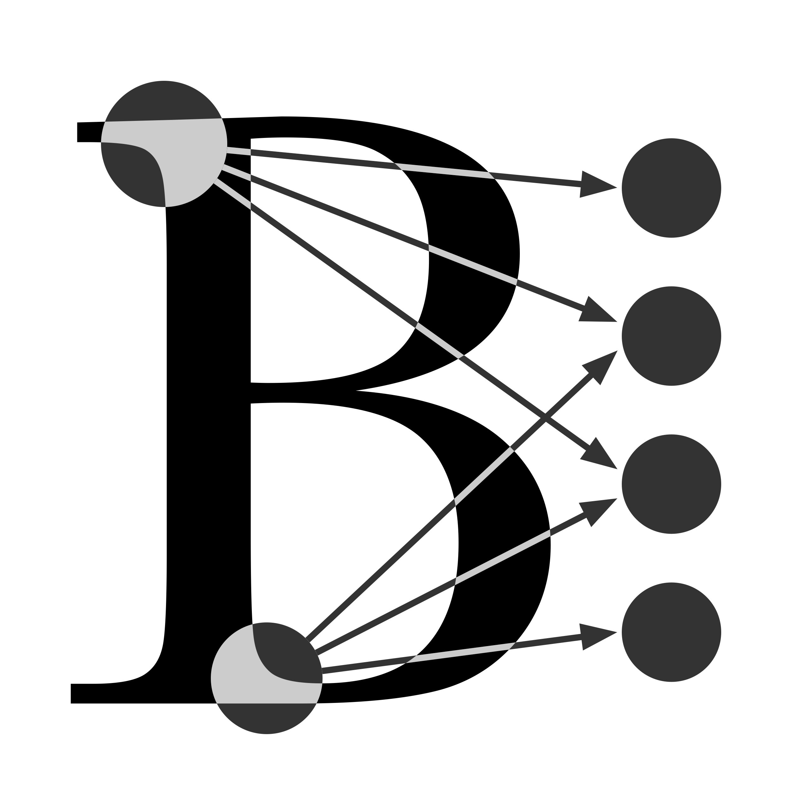

# 2024-02-14-Turing-Training

Training Material for Turing event 14th - 15th Feb

## Schedule

### Day 1

|      Time     | Event |
| --------------| ----- |
| 10:00 - 11:00 | Coffee |
| 11:00 - 12:00 | Intro to Baskerville HPC |
| 12:00 - 13:00 | Lunch |
| 13:00 - 14:00 | Intro to Baskerville Portal |
| 14:00 - 15:00 | Non-Interactive Batch Jobs |
| 15:15 - 17:00 | Interactive Jobs |

### Day 2

|      Time     | Event |
| --------------| ----- |
| 09:00 - 10:30 | Self-installed software with pip, apptainer etc |
| 10:30 - 12:00 | Profiling with Linaro Forge |
| 12:00 - 13:00 | Lunch |
| 13:00 - 17:00 | NVIDIA DLI - Fundamentals of Deep Learning (with a coffee break) |
| 17:00 - 17:00 | Close |

## Support

For technical user support, email us at [baskerville-tier2-support@contacts.bham.ac.uk](mailto:baskerville-tier2-support@contacts.bham.ac.uk)

## Acknowledgements

* [Baskerville](https://github.com/baskerville-hpc)

## [License](LICENSE.md)

 This work is licensed under a <a rel="license" href="http://creativecommons.org/licenses/by-nc-sa/4.0/">Creative Commons Attribution-NonCommercial-ShareAlike 4.0 International License</a>.
